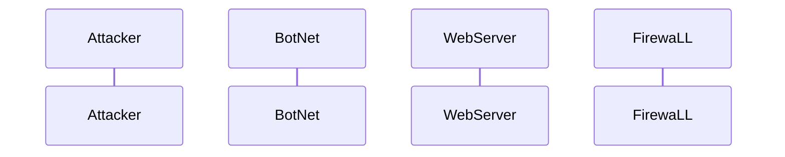

# DDoS_Attack_Sequence.md

%% Attacker initiates the command
    Attacker->>BotNet: Send attack command
    
   BotNet-)BotNet: Spread command to bots
    end
    Note over BotNet: Bots activated for attack

    BotNet->>WebServer: Begin flood of requests

    WebServer-->>Firewall: Detect abnormal traffic

    %% Firewall acts based on traffic patterns
    alt Traffic exceeds threshold
        Firewall->>Firewall: Perform traffic analysis
        Firewall->>Firewall: Blacklist offending IPs
        Firewall-->WebServer: Allow safe traffic
    else Traffic is within normal parameters
        WebServer->>BotNet: Respond to legitimate requests
    end

    %% Mitigation in progress
    Note over Firewall, WebServer: Traffic management ongoing
    
Attacker will send signal to bots in a loop
spread command to bots end
bots now activated for attack
WebServer communicates to Firewall
Detect abnormal traffic
Firewall acts based on traffic patterns
Traffic exceeds limit
Blacklist offending IPs
Allow safe traffic
