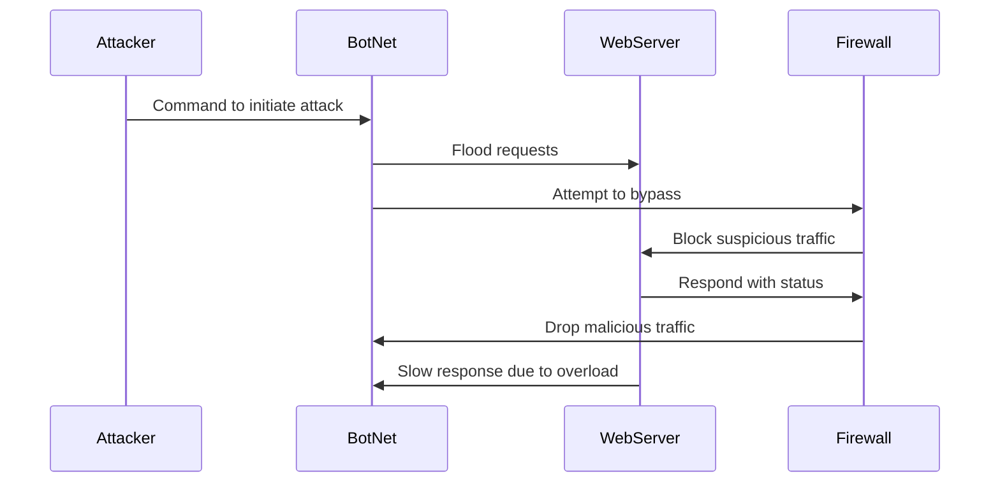

# DDoS_Attack_Sequence.md

    
1) Attacker will send signal to bots in a loop
2) spread command to bots end
3) bots now activated for attack
4) WebServer communicates to Firewall
5) Detect abnormal traffic
6) Firewall acts based on traffic patterns
7) Traffic exceeds limit
8) Blacklist offending IPs
9) Allow safe traffic
