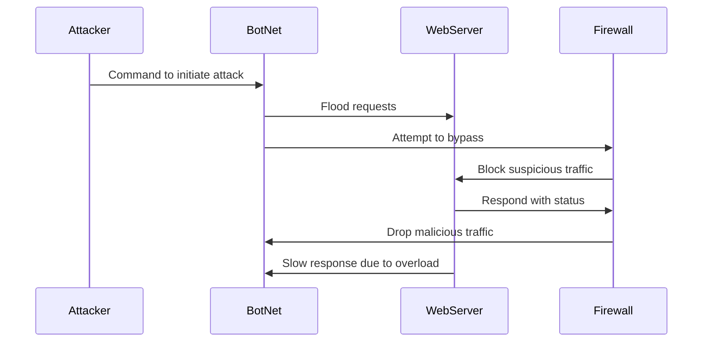

# DDoS_Attack_Sequence.md

    
Attacker will send signal to bots in a loop
spread command to bots end
bots now activated for attack
WebServer communicates to Firewall
Detect abnormal traffic
Firewall acts based on traffic patterns
Traffic exceeds limit
Blacklist offending IPs
Allow safe traffic
